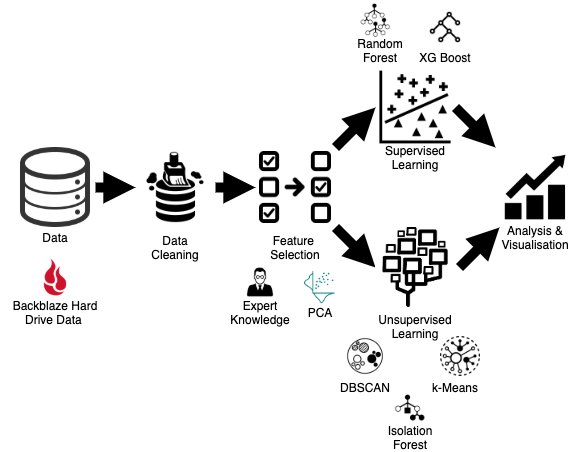
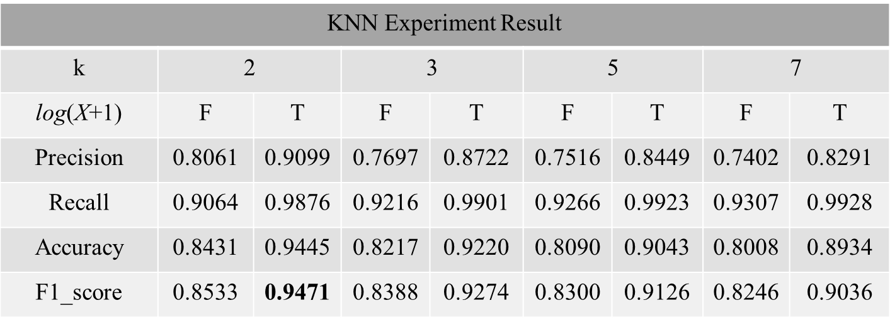
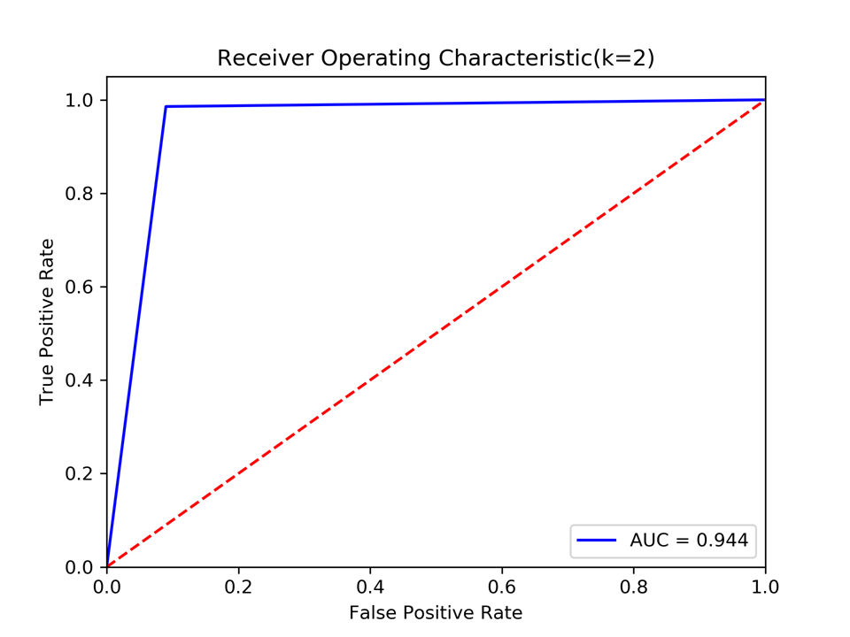

# 问题

## 数据集

BackBlaze开放数据

## 特征选择

- 可选特征

下表中属性特征没有大量的空值

|属性位置|描述|
|--|--|
|5, 187, 188, 197, 198| BackBlaze分析发现硬盘故障与SMART的位置属性有极大的关系|
|9, 193, 194, 241，242| El-Shimi分析报告指出在随机森林模型中SMART位置属性特征权重大 |

## 数据预处理

- 1.过滤指定特征的原始数据而非正则化数据：正则化定义不明
- 2.为减小样本点X中0与非0元素的差异，对X进行log(x + 1)操作；KNN不需要正则化这会使得样本点抱团
- 3.故障平滑或回溯：对故障HDD选前n天进行回溯，重置failure​ ​status为1记为正样本 
- 4.选择特定型号HDD：我们选的是“ST4000DM000”型号，因为可用数据量大
- 5.平衡数据集：对于故障硬盘，随机采该盘正常时的10天数据

## 模型选择

|模型|优点|缺点|备注|
|--|--|--|--|
|KNN|精度高、对异常值不敏感、对输入没有特定假设要求|计算复杂度高，空间复杂度高|调参：k取2, 3, 5, 7|

## 评估

- 1.评估方法：十折交叉验证
- 2.评估指标：Precision，Recall，Accuracy，F1，ROC曲线
- 3.结果

## 参考

- https://github.com/KarthikNA/Prediction-of-Hard-Drive-Failure
- https://github.com/SidiLu001/disk_failure_prediction

